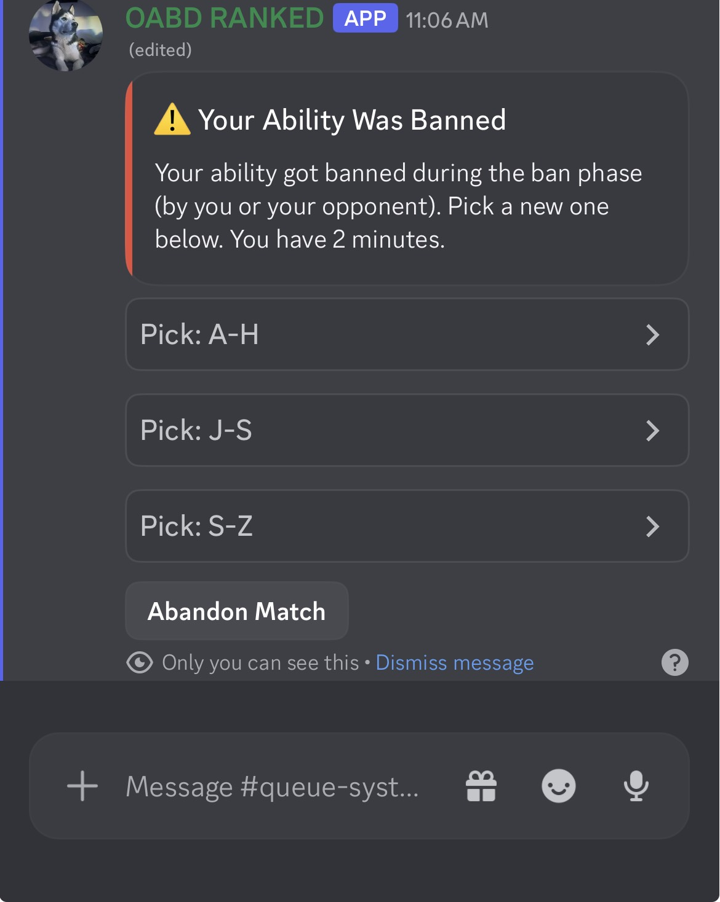

# OABD Ranked

A Discord bot that runs a complete competitive ranked ladder for a 2,000-member gaming community — matchmaking, ELO, divisions, a draft and ban phase, and the full match lifecycle from queue to result.

Built in Python with discord.py and SQLite. Deployed on Railway.

*The ban phase. The ability pool is split across several dropdowns because Discord caps a select menu at 25 options, and the message is ephemeral — only the player it belongs to can see it.*

## What it does

**Matchmaking.** Players queue with a region, an ability pick, and a preferred set length (Bo1, Bo3, or Bo5). The matchmaker pairs them within an ELO range that widens at higher divisions, where the population is thinner. Region and set-type preferences cascade: if nobody is queued in your region, the search skips straight past it rather than making you wait out a timer.

**Ranking.** Six divisions (F through S Team) of 100 LP each, subdivided into Low, Mid, and High bands for display. LP changes scale with the division gap between the two players and adjust for set length. Above S Team sits EX Team, a capped top-ten roster with its own points system that demotes its lowest member when a new player promotes in.

**Placements and demotion protection.** New players run ten placement matches and are seeded by win rate. Players sitting at a division boundary get one loss of protection before dropping.

**Anti-farming.** Repeatedly queueing into the same opponent triggers escalating cooldowns, one minute then three then blocked entirely, so LP cannot be farmed off a willing friend.

**Draft and ban phase.** Once matched, each player privately bans one ability from a dropdown. Discord caps select menus at 25 options, so the seventy-ability pool is chunked across several menus. If an ability is banned by either side, its owner is forced into a repick. Delivery tries three routes in order — editing the player's original queue response, then a direct message, then a public fallback ping — so a player with DMs closed still gets their ban phase.

**Match lifecycle.** Each match gets a private channel created on the fly and visible only to the two players. A watcher times the match out after 45 minutes, 60 for a Bo5, locks the channel, and cleans it up. Results are double-confirmed by both players before LP moves, and the channel deletes itself afterward. Every match posts an embed to a log channel that updates in place when the result lands, and promotions and demotions announce automatically.

**Seasons and statistics.** Season archiving with per-player final standings, plus per-ability usage, win-loss, and ban-rate tracking.

## Tech

**Python** with discord.py — slash commands, UI components, asyncio.
**SQLite** — nine tables covering players, matches, stats, cooldowns, seasons, and ability data, with additive migrations that no-op when re-run.
**Railway** — NIXPACKS build with a persistent volume so the database survives redeploys.

## Running it

Install dependencies:

    pip install -r requirements.txt

    Create a .env file:

        DISCORD_TOKEN=your_bot_token
            DB_PATH=ranked.db

            Start the bot:

                python OabdRanked.py

                The bot expects a few named channels and roles in the server — a queue channel, a ranked-logs channel, a ranked-announcements channel, and a match category. These are configurable in the constants block at the top of the file.
                
